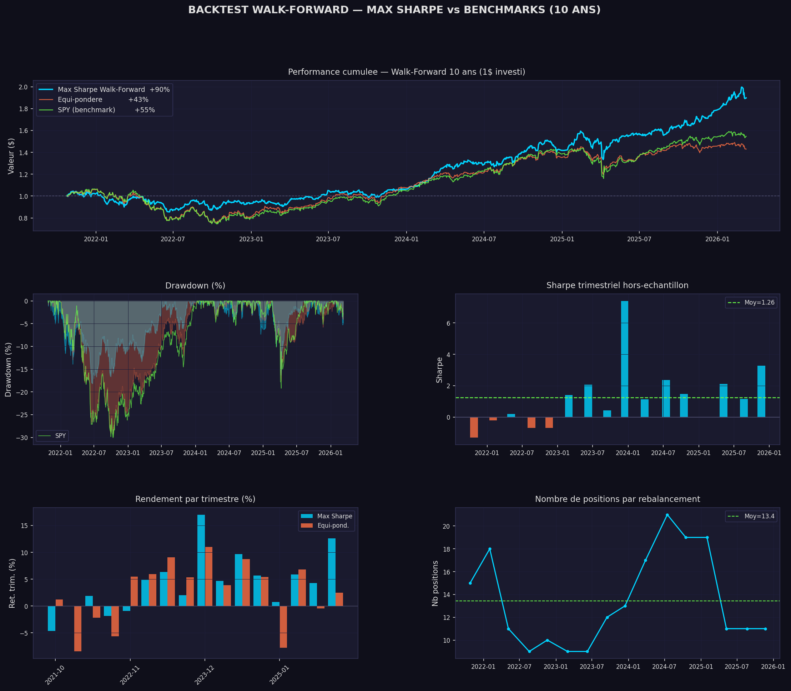

# Opti_effi_Border

**Système complet de gestion de portefeuille quantitatif : frontière efficiente de Markowitz, signaux alpha, contraintes réalistes, mesures de risque (VaR/CVaR/stress tests), backtest walk-forward, et exécution via IBKR.**



---

## 🇫🇷 Version française

### Aperçu

Opti_effi_Border couvre la chaîne complète de la gestion de portefeuille quantitative, du signal à l'exécution :

1. **Frontière efficiente** — optimisation de Markowitz (min-variance, max Sharpe)
2. **Signaux alpha** — momentum et quality, pour dépasser la seule hypothèse "le passé prédit le futur" de Markowitz
3. **Contraintes réalistes** — liquidité, exposition sectorielle max, turnover, bornes min/max par position — ce qu'un vrai fonds doit respecter et que Markowitz seul ignore
4. **Mesures de risque** — VaR historique/paramétrique, CVaR (Expected Shortfall), drawdown, stress tests
5. **Backtest walk-forward** — réoptimisation trimestrielle sur 10 ans d'historique, comparée à un benchmark equal-weight + SPY
6. **Simulation dry-run** — rejoue la stratégie sur les 6 derniers mois sans toucher au compte réel
7. **Exécution** — récupération des positions et envoi des ordres via l'API IBKR (compte paper trading)

### Résultat clé

Backtest walk-forward, réoptimisation trimestrielle (stratégie Max Sharpe) sur 16 trimestres (oct. 2021 → mars 2026), comparé à un benchmark equal-weight + SPY :

| Métrique | Portefeuille (Max Sharpe) | Benchmark |
|---|---|---|
| Rendement cumulé | **+90.9%** | +45.7% |
| Trimestres où la stratégie bat le benchmark | **10/16 (62%)** | — |
| Sharpe trimestriel moyen | **1.26** | — |

La stratégie bat le benchmark sur la période testée, mais pas systématiquement (6 trimestres sur 16 sont perdants face au benchmark, y compris un trimestre à Sharpe -1.31) — un résultat honnête plutôt qu'une courbe qui monte tout droit. Le backtest ne modélise pas encore les coûts de transaction (voir *Limites*).

### Fonctionnalités détaillées

**Frontière efficiente (`optimiseur.py`)**
- Portefeuille min-variance et max Sharpe via `scipy.optimize.minimize` (SLSQP)
- Contraintes de base : budget à 100%, pas de vente à découvert

**Signaux alpha (`alpha.py`)**
- Momentum 12-1 mois (évite le retournement à court terme)
- Quality (facteur classique de qualité fondamentale)
- Intensité du tilt alpha réglable (`ALPHA_INTENSITY`)

**Contraintes réalistes (`contraintes.py`)**
- Liquidité : plafond en % du volume journalier moyen
- Exposition sectorielle max (30% par défaut)
- Turnover limité pour réduire les frais de transaction
- Bornes 1%–15% par position (pas de micro-positions)

**Mesures de risque (`risque.py`)**
- VaR historique (quantile empirique, sans hypothèse de distribution)
- VaR paramétrique (hypothèse normale — plus rapide, sous-estime les queues épaisses)
- CVaR / Expected Shortfall (perte moyenne au-delà de la VaR)
- Drawdown et max drawdown
- Stress tests sur scénarios de marché

**Backtest walk-forward (`backtest.py`)**
- Réoptimisation trimestrielle sur un univers de 78 titres multi-devises (US, Paris, Amsterdam, Suisse)
- Fenêtre d'entraînement glissante de 252 jours
- Benchmark : equal-weight + SPY buy-and-hold

**Simulation & exécution (`simulation.py`, `rebalancement.py`, `execution.py`, `recuperer_positions.py`)**
- Dry-run 6 mois sans toucher au compte
- Plan de rebalancement précis (achat/vente, quantités, montants)
- Récupération des positions et envoi d'ordres via l'API IBKR (compte paper trading uniquement)

### Structure du projet

```
Opti_effi_Border/
├── main.py                # Menu interactif — point d'entrée unique
├── src/
│   ├── paths.py            # Chemins centraux (data/, graphs/)
│   ├── donnees.py          # Téléchargement/nettoyage des prix (yfinance)
│   ├── stats.py            # Rendements, covariance, performance
│   ├── optimiseur.py       # Frontière efficiente de Markowitz
│   ├── alpha.py            # Signaux momentum + quality
│   ├── contraintes.py      # Liquidité, secteurs, turnover
│   ├── risque.py           # VaR, CVaR, drawdown, stress tests
│   ├── allocation.py       # Allocation en dollars des portefeuilles optimaux
│   ├── backtest.py         # Backtest walk-forward 10 ans
│   ├── simulation.py       # Dry-run 6 mois
│   ├── rebalancement.py    # Plan de rebalancement (achat/vente)
│   ├── recuperer_positions.py  # Positions IBKR (TWS API)
│   └── execution.py        # Envoi des ordres (IBKR paper trading)
├── data/                   # Résultats livrés (allocations, backtest, ordres)
│   └── cache/               # Cache de prix régénérable (ignoré par git)
├── graphs/                 # Graphiques générés
├── tests/
│   └── test_portfolio_metrics.py
├── requirements.txt
├── .env.example
└── LICENSE
```

### Installation

```bash
git clone <url-du-dépôt>
cd Opti_effi_Border
python -m venv venv
source venv/bin/activate        # Windows : venv\Scripts\activate
pip install -r requirements.txt
cp .env.example .env            # utile seulement pour recuperer_positions.py / execution.py (IBKR)
```

### Utilisation

```bash
python main.py
```

Menu interactif :

```
[1] Frontière efficiente Markowitz
[2] Analyse du risque (VaR / CVaR / Stress)
[3] Contraintes réelles (secteur / turnover)
[4] Signaux Alpha (Momentum + Quality)
[5] Backtest walk-forward 10 ans
[6] Simulation dry-run 6 mois
[7] Exécution des ordres (paper trading)
```

Les options 1 à 6 ne nécessitent aucune connexion IBKR — uniquement les prix de marché via yfinance (mis en cache après le premier téléchargement). Seules les options « Exécution » (récupération de positions, envoi d'ordres) nécessitent TWS/IB Gateway ouvert et un `.env` configuré.

### Tests

```bash
pytest tests/
```

Les tests couvrent les statistiques de portefeuille, les propriétés du portefeuille optimal (poids qui somment à 1, pas de vente à découvert, Sharpe du portefeuille max-Sharpe ≥ min-variance), et les mesures de risque (CVaR ≥ VaR, calcul du drawdown maximal).

### Stack technique

Python · pandas · NumPy · SciPy (optimisation) · yfinance · Matplotlib · pytest · IBKR TWS API (`ibapi`)

### Limites & pistes d'amélioration

- Le backtest ne modélise pas les coûts de transaction ni le slippage — un facteur qui réduirait le rendement net, surtout avec des réoptimisations trimestrielles sur un univers multi-devises.
- Univers fixe de 78 titres (pas de sélection dynamique de l'univers d'investissement).
- Testé exclusivement en paper trading IBKR — **ce n'est pas un conseil en investissement**.

---

## 🇬🇧 English version

### Overview

Opti_effi_Border covers the full quantitative portfolio management chain, from signal to execution:

1. **Efficient frontier** — Markowitz optimization (min-variance, max Sharpe)
2. **Alpha signals** — momentum and quality, to go beyond Markowitz's "the past predicts the future" assumption
3. **Realistic constraints** — liquidity, max sector exposure, turnover, min/max position bounds — what a real fund must respect and Markowitz alone ignores
4. **Risk measures** — historical/parametric VaR, CVaR (Expected Shortfall), drawdown, stress tests
5. **Walk-forward backtest** — quarterly re-optimization over 10 years of history, benchmarked against an equal-weight + SPY portfolio
6. **Dry-run simulation** — replays the strategy over the last 6 months without touching the real account
7. **Execution** — retrieving positions and sending orders via the IBKR API (paper trading account)

### Key result

Walk-forward backtest, quarterly re-optimization (Max Sharpe strategy) over 16 quarters (Oct 2021 → Mar 2026), benchmarked against an equal-weight + SPY portfolio:

| Metric | Portfolio (Max Sharpe) | Benchmark |
|---|---|---|
| Cumulative return | **+90.9%** | +45.7% |
| Quarters beating the benchmark | **10/16 (62%)** | — |
| Average quarterly Sharpe | **1.26** | — |

The strategy beats the benchmark over the tested period, but not systematically (6 of 16 quarters underperform the benchmark, including one quarter at a -1.31 Sharpe) — an honest result rather than a straight-up equity curve. The backtest does not yet model transaction costs (see *Limitations*).

### Detailed features

**Efficient frontier (`optimiseur.py`)**
- Min-variance and max-Sharpe portfolios via `scipy.optimize.minimize` (SLSQP)
- Base constraints: fully invested, no short-selling

**Alpha signals (`alpha.py`)**
- 12-1 month momentum (avoids short-term reversal)
- Quality (classic fundamental quality factor)
- Adjustable alpha-tilt intensity (`ALPHA_INTENSITY`)

**Realistic constraints (`contraintes.py`)**
- Liquidity: cap as % of average daily volume
- Max sector exposure (30% by default)
- Limited turnover to reduce transaction costs
- 1%–15% bounds per position (no micro-positions)

**Risk measures (`risque.py`)**
- Historical VaR (empirical quantile, no distributional assumption)
- Parametric VaR (normal assumption — faster, understates fat tails)
- CVaR / Expected Shortfall (average loss beyond VaR)
- Drawdown and max drawdown
- Stress tests on market scenarios

**Walk-forward backtest (`backtest.py`)**
- Quarterly re-optimization over a 78-stock, multi-currency universe (US, Paris, Amsterdam, Switzerland)
- Rolling 252-day training window
- Benchmark: equal-weight + SPY buy-and-hold

**Simulation & execution (`simulation.py`, `rebalancement.py`, `execution.py`, `recuperer_positions.py`)**
- 6-month dry-run without touching the account
- Precise rebalancing plan (buy/sell, quantities, amounts)
- Position retrieval and order submission via the IBKR API (paper trading only)

### Project structure

```
Opti_effi_Border/
├── main.py                # Interactive menu — single entry point
├── src/
│   ├── paths.py            # Central paths (data/, graphs/)
│   ├── donnees.py          # Price download/cleaning (yfinance)
│   ├── stats.py            # Returns, covariance, performance
│   ├── optimiseur.py       # Markowitz efficient frontier
│   ├── alpha.py            # Momentum + quality signals
│   ├── contraintes.py      # Liquidity, sectors, turnover
│   ├── risque.py           # VaR, CVaR, drawdown, stress tests
│   ├── allocation.py       # Dollar allocation of optimal portfolios
│   ├── backtest.py         # 10-year walk-forward backtest
│   ├── simulation.py       # 6-month dry-run
│   ├── rebalancement.py    # Rebalancing plan (buy/sell)
│   ├── recuperer_positions.py  # IBKR positions (TWS API)
│   └── execution.py        # Order submission (IBKR paper trading)
├── data/                   # Delivered results (allocations, backtest, orders)
│   └── cache/               # Regenerable price cache (git-ignored)
├── graphs/                 # Generated charts
├── tests/
│   └── test_portfolio_metrics.py
├── requirements.txt
├── .env.example
└── LICENSE
```

### Installation

```bash
git clone <repo-url>
cd Opti_effi_Border
python -m venv venv
source venv/bin/activate        # Windows: venv\Scripts\activate
pip install -r requirements.txt
cp .env.example .env            # only needed for recuperer_positions.py / execution.py (IBKR)
```

### Usage

```bash
python main.py
```

Interactive menu:

```
[1] Markowitz efficient frontier
[2] Risk analysis (VaR / CVaR / Stress)
[3] Real-world constraints (sector / turnover)
[4] Alpha signals (Momentum + Quality)
[5] 10-year walk-forward backtest
[6] 6-month dry-run simulation
[7] Order execution (paper trading)
```

Options 1 to 6 require no IBKR connection — only market prices via yfinance (cached after the first download). Only the "Execution" options (position retrieval, order submission) require TWS/IB Gateway open and a configured `.env`.

### Tests

```bash
pytest tests/
```

Tests cover portfolio statistics, optimal-portfolio properties (weights summing to 1, no short-selling, max-Sharpe portfolio's Sharpe ≥ min-variance's), and risk measures (CVaR ≥ VaR, max drawdown computation).

### Tech stack

Python · pandas · NumPy · SciPy (optimization) · yfinance · Matplotlib · pytest · IBKR TWS API (`ibapi`)

### Limitations & next steps

- The backtest does not model transaction costs or slippage — a factor that would reduce net returns, especially with quarterly re-optimizations across a multi-currency universe.
- Fixed 78-stock universe (no dynamic investment-universe selection).
- Tested exclusively in IBKR paper trading — **this is not investment advice**.

---

## Author

**Deo ZANTOKO** — Engineering student in Applied Mathematics, Mathematical Modelling for Finance & Insurance (MMFA), CY Tech

## License

MIT — see [LICENSE](LICENSE).
